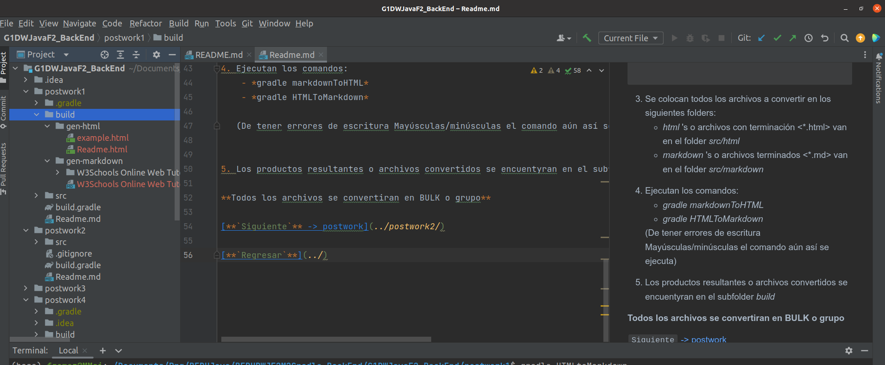

## Postwork sesión 1: Compilación de markdown

### 🎯 OBJETIVO

- Compilar un archivo en lenguaje Markdown a HTML

### DESARROLLO

En esta sesión aprendimos qué es Gradle y cómo podemos utilizarlo para automatizar algunos procesos como compilación y ejecución
de proyectos. Vamos a realizar un ejemplo empleando el [Gradle Markdown Plugin](https://github.com/kordamp/markdown-gradle-plugin).

### PASOS

1. Se creo un archivo de configuración de Gradle 'build.gradle' como indica la documentación del
[plugin](https://github.com/kordamp/markdown-gradle-plugin).
   ```
   plugins {
    id "org.kordamp.gradle.markdown" version "2.2.0"
   }
   ```

2. Ejecuta el comando gradle dentro del folder postwork1
   ``` 
   gradle.build
   ```

3. Crea la estructura de archivos:
   ```
    Projecto<Postwork1>    
      ├── src  *(Source Directory, manually created/ should be created by the user)*
      │     ├── markdown
      │     └── html
      └── build *(Output Directory,autogenerated after running the commands)*
           ├── gen-markdown
           └── gen-html
   ```

4. Se colocan todos los archivos a convertir en los siguientes folders:
   - *html* 's o archivos con terminación <*.html> van en el folder *src/html*
   - *markdown* 's o archivos terminados <*.md>   van en el folder *src/markdown*
   
5. Ejecutan los comandos:
    - *gradle markdownToHTML*
    - *gradle HTMLToMarkdown*
    
   (De tener errores de escritura Mayúsculas/minúsculas el comando aún así se ejecuta)

6. Los productos resultantes o archivos convertidos se encuentyran en el subfolder *build*

**Todos los archivos se convertiran en BULK o grupo**

   

[**`Siguiente`** -> postwork](../postwork2/)

[**`Regresar`**](../)