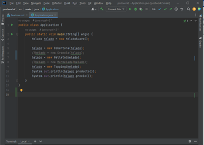
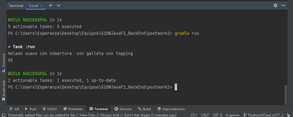

## Postwork Sesión 2: Patrón Decorador

### 🎯 OBJETIVO

- Resolver un problema utilizando patrones de diseño
- Construir la solución utilizando Gradle

### DESARROLLO

En esta sesión aprendimos la importancia de los patrones de diseño en el desarrollo y el cómo pueden facilitarnos la solución de diversos problemas a través de la Programación Orientada a Objetos. 


**Indicaciones generales:**

Una cadena de helados muy famosa en el país ha solicitado tu ayuda para implementar una nueva versión de su sistema actual. Sus productos disponibles son los siguientes:


- Helado Suave	**$30**
- Con Cobertura	**$20 extra**
- Con Granola 	**$10 extra**
- Con Topping	**$20 extra**

El sistema actualmente está diseñado usando el lenguaje Java y tienen una clase por cada variante de los productos,
pero la cadena busca agregar nuevos extras:

- Con Mermelada	**$10 extra**
- Con Galleta		**$15 extra**
<br>

### INSTRUCCIONES DE OPERACIÓN

1. Baja el código en tu computadora.

2. Ejecuta el comando gradle dentro del folder postwork.
   ``` 
   gradle build
   ```

3. Modifica comentando y descomentado los complementos
del helado que no deseas incluir en la orden




4. Ejecuta el comando gradle dentro del folder postwork.
   ``` 
   gradle run
   ```

5. Observa la orden de tu helado y el costo a pagar.


   

[**`Siguiente`** -> postwork](../postwork3/)

[**`Regresar`**](../)