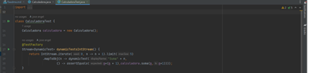
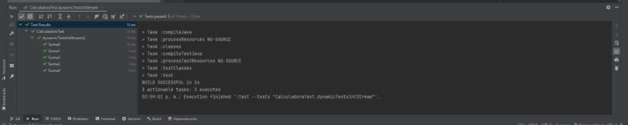

## Postwork Sesión 3: Pruebas dinámicas

### 🎯 OBJETIVO

- Utilizar JUnit para probar una pieza de código
- Utilizar las anotaciones de JUnit para correr
- Realizar pruebas dinámicas usando JUnit 5

### INSTRUCCIONES


1. Baja el código en tu computadora.

2. Ejecuta el comando gradle dentro del folder postwork.
   ``` 
   gradle build
   ```

3. Verifica que el número de pruebas a realizar sea el deseado. 

4. Ejecuta el comando gradle dentro del folder postwork.
   ``` 
   gradle test
   ```
***Ejecutando postwork3 con código hecho por el equipo***

 

5. Observa los resultados obtenidos en las pruebas.
   


[**`Siguiente`** -> postwork](../postwork4/)

[**`Regresar`**](../)
