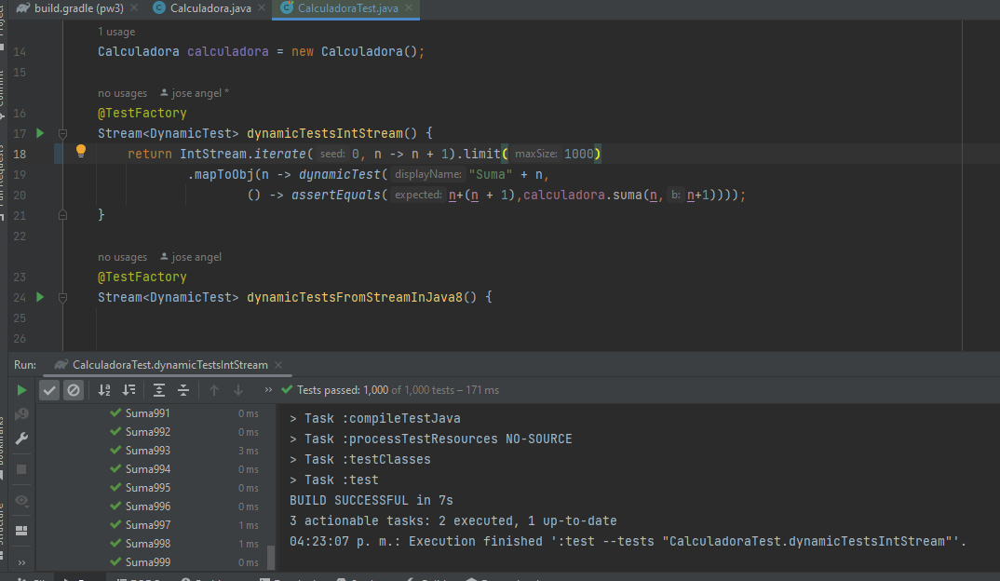
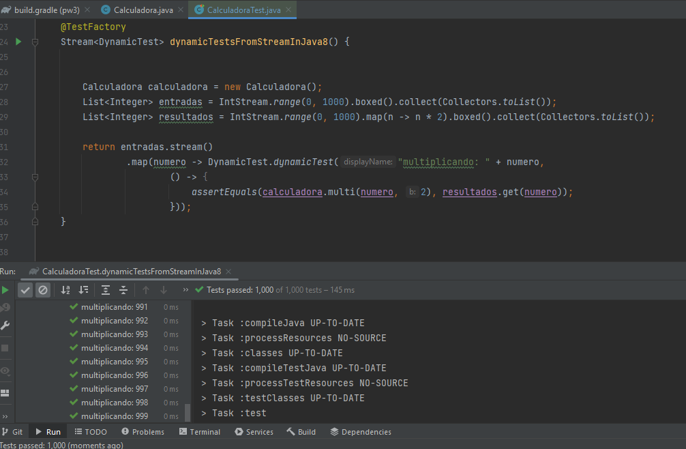

## Postwork Sesión 3: Pruebas dinámicas

### 🎯 OBJETIVO

- Utilizar JUnit para probar una pieza de código
- Utilizar las anotaciones de JUnit para correr
- Realizar pruebas dinámicas usando JUnit 5

### DESARROLLO

En esta sesión aprendimos qué son las anotaciones en Java ayudan a agregar información adicional a un programa y que hay herramientas que explotan esta funcionalidad como lo es JUnit.

Recuerda que todo lo trabajado en tu prework, así como durante la sesión, puede ser aplicado a tu proyecto personal. 

El postwork se realizará en equipo, los cuales serán formados previamente a la sesión uno.

**Asegúrate de comprender:**

1. Cómo construir una solución utilizando Gradle
2. Qué es una anotación
3. Cómo usar JUnit

Los casos de prueba anotados con `@Test` son pruebas estáticas, esto quiere decir que al momento de compilar la aplicación ya se tienen todos los elementos de la prueba listos para ejecutarse y su comportamiento no puede cambiarse. Esto es muy útil cuando tenemos un conjunto pequeño de datos con los que queremos hacer la prueba. Pero puede convertirse en un problema cuando tenemos un conjunto grande o dinámico de las mismas `@Test` tiene muchas limitaciones. 

Para sortear estas limitaciones, JUnit 5 agrega pruebas dinámicas, que son pruebas que se generan en tiempo de ejecución por un elemento conocido como fábrica de pruebas. Para esto también agrega una nueva anotación `@TestFactory`. 

Los métodos anotados con `@TestFactory` sirven para crear fábricas de pruebas. Estos métodos deben regresar un `DynamicNode`, `Stream`, `Collection`, `Iterable`, `Iterator`, o arreglo de `DynamicNode`.

El cliente de la calculadora nos ha dicho que algunos de sus ingenieros dudan de la calidad de nuestra calculadora, ya que se realizaron muy pocas pruebas de la misma y nos pide que generemos 1000 pruebas de alguna operación realizada por la calculadora para ganarnos su total y entera confianza. 

Para demostrarles que estamos comprometidos con nuestros clientes y queremos darles la tranquilidad a todos los miembros de su equipo, hemos decidido que realizaremos 1000 pruebas. Como no queremos estar todo el día escribiendo las pruebas, y después de una larga sesión de planeación con los Projects Managers, el becario (quién acaba de terminar la sesión 3 de este módulo y por lo tanto ya conoce la respuesta al problema) nos ha sugerido que usemos una prueba dinámica para generar las 1000 evidencias que necesitamos.

En este postwork deberás crear una prueba dinámica sobre cualquiera de las operaciones de la calculadora. La prueba debe ejecutarse al menos 1000 veces con números distintos, y debes garantizar que todas las ejecuciones terminen con un resultado exitoso.

A continuación te dejamos una lista de recursos donde podrás obtener más información de `@TestFactory`:
- [https://mincong.io/2021/04/09/junit-5-dynamic-tests/](JUnit 5: Dynamic Tests with TestFactory)
- [https://javabydeveloper.com/junit-5-dynamic-tests-testfactory-with-examples/](Junit 5 dynamic tests @TestFactory with examples)
- [https://roytuts.com/dynamic-tests-testfactory-in-junit-5/](Dynamic Tests – @TestFactory in Junit 5)

<br>


1. Baja el código en tu computadora.

2. Ejecuta el comando gradle dentro del folder postwork.
   ``` 
   gradle build
   ```

3. Modifica comentando y descomentado los complementos
   del helado que no deseas incluir en la orden

4. Ejecuta el comando gradle dentro del folder postwork.
   ``` 
   gradle test
   ```




[**`Siguiente`** -> postwork](../postwork4/)

[**`Regresar`**](../)
