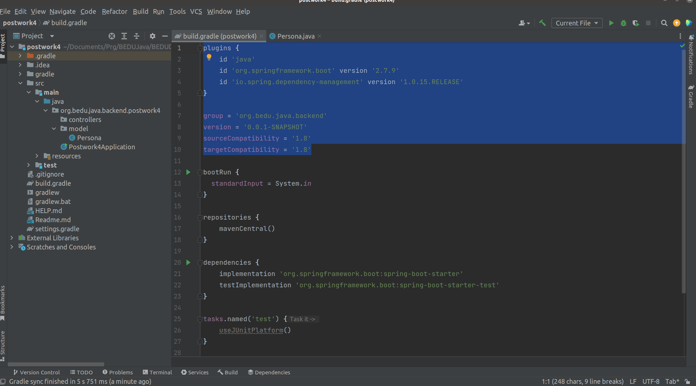
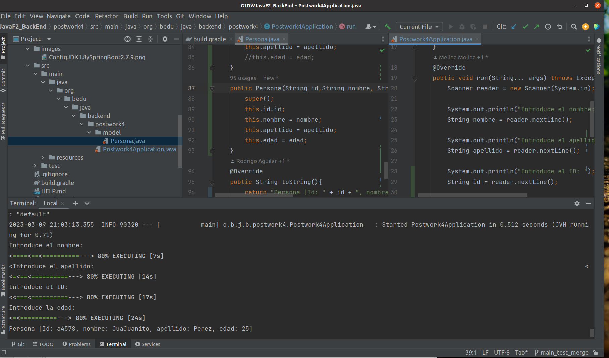

## Postwork Sesión 4: Aplicación de línea de comandos

### 🎯 OBJETIVO

- Implementar una aplicación de línea de comandos utilizando Spring Boot

### INSTRUCCIONES


1. Baja el código en tu computadora.

2. Ejecuta el comando gradle dentro del folder postwork.
   ``` 
   gradle build
   ```
3. Si trabajas con equipos donde alguno tiene una version mas antigua de 
JDK que la tuya (ejemplo JDK 18), para hacer codigo compatible con tus colegas
revisa estas lineas en gradle.build



4. Ejecuta la aplicación directamente desde el IDE de tu preferencia o mediante el comando 

   ``` 
   gradle bootRun
   ```
5. Interactúa con la aplicación mediante la línea de comandos, ingresando el nombre, apellido, Id y edad según sean solicitados.    



[**`Siguiente`** -> postwork](../postwork5/)

[**`Regresar`**](../)