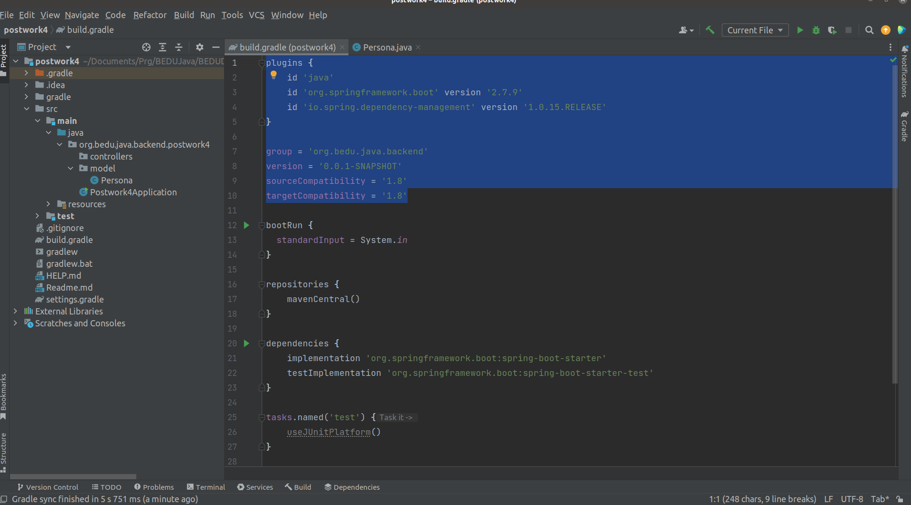
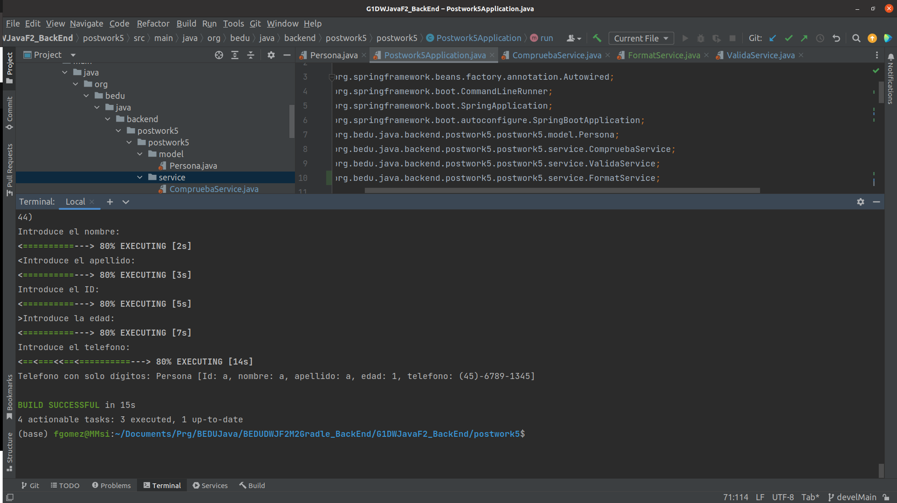
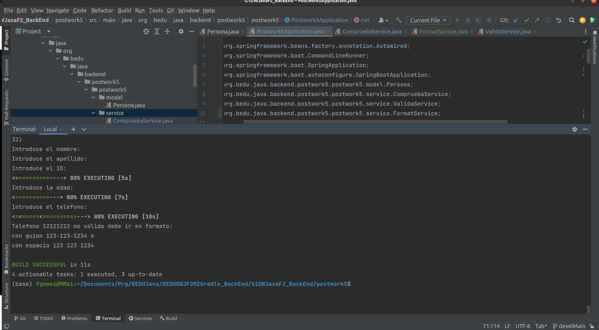

## Postwork Sesión 5: Inversión de Control (IoC) en Spring Boot

### 🎯 OBJETIVO

- Extender el programa de línea de comandos para utilizar el IoC de Spring Boot

### DESARROLLO

En esta sesión aprendimos qué es la Inversión de Control y cómo usar los JavaBeans junto con la Inyección de Dependencias en Spring Boot. 

El postwork se realizará en equipo, los cuales serán formados previamente a la sesión uno.

**Asegúrate de comprender:**

1. Cómo utilizar el Spring Initializr para crear un proyecto
2. Cómo configurar un proyecto de Gradle
3. Cómo crear una aplicación de líneas de comandos en Spring Boot
4. Cómo utilizar la Inyección de Dependencias en Spring Boot


**Indicaciones generales**

En el Postwork de la sesión anterior implementamos una línea de comandos que solicitaba un nombre y número de teléfono de una `Persona`. 

En esta ocasión tu misión será extender este programa para que la línea de comandos para que:

1. Valide que el número de teléfono solo contenga caracteres válidos: números, guion medio y espacio en blanco.
1. Valide que el número de teléfono contenga 10 dígitos.
1. Si se tiene un número válido, elimine todos los caracteres que no sean numéricos.
1. De al número de teléfono un formato de (##)-####-#### antes de imprimirlo en la consola.

Dicha implementación debe estar contenida en dos clases “servicio” que deben ser inyectada en la clase principal.

Recuerda que deberás implementar la interface `CommandLineRunner` que proporciona Spring Boot, para que por medio de línea de comandos reciba una cadena de texto y que para leer datos a través de una línea de comandos se utiliza la clase `Scanner` del paquete `java.util`.

Además, en el archivo de configuración de Gradle debes agregar la siguiente línea:

```groovy
bootRun {
  standardInput = System.in
}

```

<br/>

1. Baja el código en tu computadora.

2. Ejecuta el comando gradle dentro del folder postwork.
   ``` 
   gradle build
   ```
2. 1. Si trabajas con equipos donde alguno tiene una version mas antigua de
      JDK que la tuya, ejeplo JDK 18; para hacer codigo compatible con tus colegas
      revisa estas lineas en gradle.build



4. Modifica comentando y descomentado los complementos
   del helado que no deseas incluir en la orden

4. Ejecuta el comando gradle dentro del folder postwork.
   ``` 
   gradle bootRun
   ```
* Ejecutando postwork5-Teléfono valido

* Ejecutando postwork5-Teléfono no valido



[**`Siguiente`** -> postwork](../postwork6/)

[**`Regresar`**](../)