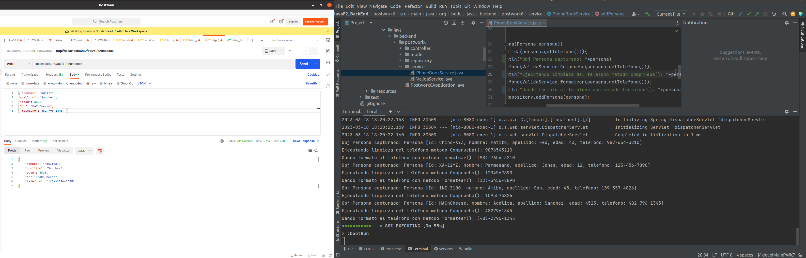
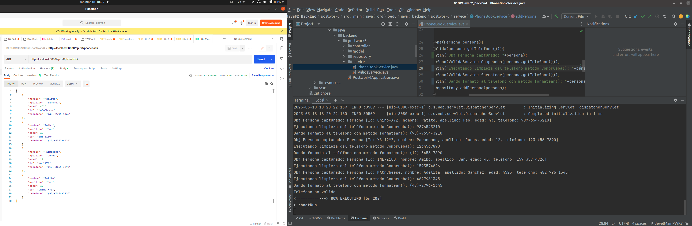

## Postwork Sesión 6: Introducción a Spring MVC

### OBJETIVO

- Reemplazar la aplicación de línea de comandos por un API Rest que reciba la información de nombre y teléfono.
- Tener un almacenamiento temporal de la información en la memoria.
- Desarrollar un Endpoint que regrese la información almacenada en la agenda.


### DESARROLLO

En esta sesión aprendimos MVC como estilo arquitectónico para nuestras aplicaciones. Ahora lo usaremos para dejar atrás la línea de comandos y realizar el desarrollo de un API Rest que nos ayude con el manejo de nuestra agenda telefónica.

El postwork se realizará en equipo, los cuales serán formados previamente a la sesión uno.

**Asegúrate de comprender:**

1. Cómo utilizar el Spring Initializr para crear un proyecto
2. Cómo configurar un proyecto de Gradle
3. Cómo crear un controlador REST en Spring MVC.
4. Cómo utilizar la Inyección de Dependencias en Spring Boot

**Indicaciones generales**

En el Postwork de la sesión anterior continuamos con la implementación de nuestra agenda, recibiendo y formateando el nombre y número de teléfono de una persona.

En ésta ocasión tu misión será eliminar el uso de la línea de comandos y reemplazarlo por un API Rest que contenga las siguientes funcionalidades.

1. Reciba la información del nombre y número de teléfono y aplique el mismo proceso de validación y limpieza del teléfono que desarrollamos en el módulo anterior.
1. Almacene la información en memoria usando un `Set` de Java que ordene las entradas de forma alfabética por el nombre de la persona. Para lograr esto `Persona` deberá implementar la interface `java.lang.Comparable`
1. Un servicio REST que al hacer una petición **GET** regrese la información de la agenda en formato JSON.
1. La aplicación debe implementar el patrón MVC. Esto quiere decir que el modelo se encontrará en una capa, el acceso a datos en otra capa y la vista (los servicios Rest) en otra capa. Es posible que para esto debas crear más de un nuevo paquete en la aplicación. 


La lógica de la aplicación debe estar contenida en una clase “servicio” que deberá recibir todas sus dependencias a través de inyección por constructor.


1. Baja el código en tu computadora.

2. Si trabajas con equipos donde alguno tiene una version mas antigua de
   JDK que la tuya, ejeplo JDK 18; para hacer codigo compatible con tus colegas
   revisa estas lineas en gradle.build


3. Ejecuta el comando gradle dentro del folder postwork.
   ``` 
   gradle bootRun
   ```
4. Ejecución:
JSON:

```
{ "nombre": "nombre", 
"apellido": "spllido",
 "edad": ##,
 "id": "XX",
  "telefono":"##-####-##-##"} 
```
* Ejecutando postwork6-POST
```
POST
http://localhost:8080/api/v1/phonebook
```
  
* Ejecutando postwork6-GET

```
GET
http://localhost:8080/api/v1/phonebook
```

  


[**`Siguiente`** -> sesión 07](../postwork7/)

[**`Regresar`**](../)